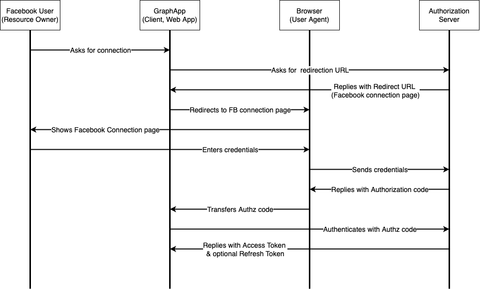

Jean-François Pasche  
Janvier 2023

> 1. You are developing a software that takes the Facebook friends of a user and displays a nice
friendship graph out of it. For this, you need to somehow gain access to the Facebook account of
the user. Why isn’t it recommended in this case to use passwords ? Give all the reasons you can
think of.

L'application doit essentiellement accéder à des données qui existent sur un service tier, en l'occurence Facebook. Son but n'est en aucun cas de fournir un moyen d'authentification. Pour fonctionner, elle a simplement besoin d'un utilisateur disposant d'compte Facebook. Il est donc logique de déléguer à Facebook l'authentification. En plus, cela évite la gestion de mots de passe avec tout ce que cela implique en terme de sécurité de stockage des données.

> 2. Let’s suppose that you are using OAuth2 for managing the authorization of your Facebook friendship graph website. Draw a schema describing what are the interactions between your app, Facebook, and the user for a legitimate request (obtaining Facebook friends) and for an illegitimate request (e.g. obtaining the private messages of the user). Explain which mechanism will disallow the app to recover private messages.

Pour commencer, il convient de discuter plus en détail du type d'application auquel on a affaire. Il pourrait s'agir :
1. D'une application serveur accessible avec un navigateur internet. Dans ce cas, le navigateur ne fait qu'afficher les résultats des calculs effectués sur le serveur.
2. D'une application client. Dans ce cas, le serveur ne fait que mettre à disposition l'application. Cette dernières est téléchargée par le navigateur du *end-user* et est entièrement exécutée dans le navigateur. Autrement dit, aucune interaction n'a lieu avec le serveur après le chargement initial de l'application.

**Dans les réponses qui suivent, sauf mentionné explicitement, c'est le type (2) qui a été retenu.**  

Avant tout, il est nécessaire de bien compendre les concepts suivants, utilisés par OAuth2:
- `Resource Owner` : Il s'agit de l'utilisateur qui possède les données sur le service tier, dans notre cas l'utilisateur Facebook.
- `Client` : Il s'agit de l'application qui accède aux resources tièrces dont l'autorisation d'accès se fait au moyen de OAUTH2.
- `User Agent` : Il s'agit de l'application qui est utilisée pour communiquer avec le serveur d'autorisation du service duquel le `Client` veut accéder aux ressources. Cela est dans la plupart de cas le navigateur web en lui-même ou une application mobile. Le `User Agent` est conceptuellement distinct du `Client`, qui lui est l'application qui veut accéder aux données. Le `User Agent` peut être considéré comme un tier de confiance du point de vue du `Resource Owner`.
- `Authorization Server` : Il s'agit du serveur d'autorisation du service duquel le `Client` veut accéder aux ressources.
- `Resource Server` : Il s'agit en lui-même du service duquel le `Client` veut accéder aux ressources.
- `Athorization code` : Il s'agit du code utilisé pour authentifier le `Client`.
- `Access Token` : Il s'agit du token permettant au `Client` d'accéder aux ressources du `Resource Owner`. Ce token ne doit révéler aucune information sur l'utilisateur au `Client`. Il contient une durée de validité et un *scope*, qui sont vérifiés à chaque requête par le `Resource Server`.
- `Refresh Token` : token optionnel permettant au client de demander un nouvel `Access Token`, lorsque la validité de celui-ci échoit, sans avoir besoin d'intéragir avec l'utilisateur. Cela permet à l'`Authorization Server` de délivrer des `Access Token` token de très courte durée de validité. C'est particulièrement utile si le `Resource Server` est de type *stateless*.

Nous supposons ici que l'application de graphe est une application purement client, tournant par exemple dans un navigateur web.  

Ce diagramme montre les interations ayant lieu lors de l'authentification :

Dans l'`Access Token` délivré dans le cadre de notre application, le *scope* donne l'autorisation d'accéder uniquement aux amis de l'utilisateur (`Resource Owner`). Quant à la présence d'un `Refresh Token`, elle dépend de l'API Facebook et de son implémentation de OAuth2.

Ce diagramme montre les interations entre le `Client` et le `Resource Server` :

Lorsque le `Resource Server` reçoit une requête, il vérifie d'abord l'athenticité et l'intégrité du token. Il vérifie aussi sa date de validité. Ensuite, il vérifie que la ressource demandée par le `Client` est comprise dans le *scope* du token, c'est-à-dire que le `Client` a le droit d'accéder à la ressource demandée. Ce mécanisme permettrait de rejeter une requête du `Client` pour les messages privés du `Resource Owner`.

> 3. Your Facebook friendship graph website runs only over HTTP. Although this is bad, you cannot change this. You decide to use the OAuth2 protocol for authorization. However, by default, the requests are not signed (unlike in OAuth1). What could an adversary do ? Be precise and provide an example. Provide also a detailed technical solution that would fix the problem. Don’t forget to propose algorithms. Explain also how the keys are managed.

Dans le chapitre 3.1 de la RFC 6749 (qui spécifie OAuth2), il est précisé que les *endpoints* utilisés pour l'interaction liée à OAuth2 doivent utiliser TLS. Il n'y a donc pas grand risque pour notre application. En fait, seul son chargement est un problème. Un attaquant pourrait modifier le code de l'application dans in MITM et tenter ainsi de rediriger l'utilisateur vers un site frauduleux qui se ferait passer pour Facebook.  
Cependant, il semblerait que cette question soit plutôt destinée au cas d'une application serveur. Dans ce cas, un attaquant pratiquant un MITM pourrait récupérer l'`Authorization code` et s'identifier à la place du client légitime auprès du serveur d'authorisation.  
Le plus simple, dans ce cas, est d'utiliser PKSE, qui est discuté à la question 6. Encore faut-il que Facebook propose cette possibilité.  
Sinon, on pourrait utiliser une PAKE. Je pense plus particulièrement à OPAQUE, qui permet d'établir une communication confidentielle et authentifiée entre un client et un serveur, sans que le serveur ait à connaître le mot de passe du *end-user*. On utiliserait alors son mot de passe Facebook pour l'authentification. Le problème est que le *end-user* peut changer son mot de passe Facebook à tout moment. Notre application ne serait alors plus en mesure de le reconnaître.

> 4. In our scenario, how would a user revoke access to his account ? Explain technically what it implies. What prevents a malicious application to reuse some previously generated tokens ?  

Pour révoquer un client OAuth2, il faut signaler à l'`Authorization Server` que l'`Access Token` lié à cette application doit être invalidé. Il se peut que l'`Authorization Server` utilise des `Refresh Token`. Dans ce cas, se sont eux que le serveur doit invalider. Typiquement l'`Authorization Server` maintient une base de donnée des token valides et les supprime lorsque l'utilisateur demande leur révocation, ou que le serveur détecte que le client a été compomis.  
Dans le cas de notre application, une possibilité est d'offrir une fonction de *logout* qui permette de révoquer l'accès aux données utilisateurs directement. Une seconde possibilité est que l'utilisateur utilise directement l'interface proposée par Facebook qui liste les applications autorisées et qui permet de supprimer les clients.  
Au niveau de ce que cela implique, cela dépend des choix d'implémentation côté Facebook. Si un système de base de donnée de type whitiste est utilisé et que le `Resource Server` vérifie à chaque requête si l'`Access Token` est dans cette liste, la révocation est immédiate. A noter que dans ce cas, les optionnels `Refresh Token` ne sont pas utilisés.  
Une seconde possibilité implique l'utilisation de `Refresh Token` et  `Resource Server` de type *stateless*. Dans ce cas, l'`Authorization Server` maintient une liste de ces token valides. Révoquer un client implique alors dans les faits de révoquer les  `Refresh Token` qui lui sont liés. Ce dernier ne pourra alors plus obtenir des  `Access Token`. L'accès de ce client aux données utilisateurs sera alors effectif lors de l'échéance du dernier `Access Token` délivré par l'`Authorization Server`. Autrement dit, la révocation de l'accès n'est dans ce cas pas immédiate. C'est pourquoi dans le cas d'un `Resource Server` de type *stateless*, il est recommandé que les `Access Token` est une durée de validité très courte.

> 5. In your Facebook friendship graph software, what information would typically contain all the JWTs used by OAuth2 ? Would you need to encrypt the token ? Justify. What expiration time would you typically set ?  

OAuth2 utilise au moins un token, l'`Access Token`. Il y a aussi l'`Authorization Code`. Il est définit au chapitre 1.3.1 de la [RFC 6749 (OAuth2)](https://www.rfc-editor.org/rfc/rfc6749#section-1.3.1). En fonction de l'implémentation, des `Refresh Token` sont aussi utilisés. Ils ont la même physionomie que les `Access Token`.
L'`Access Token` est défini au chapitre [1.4 de la RFC 6749](https://www.rfc-editor.org/rfc/rfc6749#section-1.4). C'est une chaîne de caractère qui représente des identifiants permettant d'accéder à une ressource délévrée par un `Resource Server`. La RFC 6749 précise que ce token peut avoir différent formats, structures et méthodes, et que cela dépend des besoins.  
On va donc supposer que Facebook a choisit JWT comme format pour ses  `Access Token`. La RFC 6749 ne précise pas quelles informations doivent être contenues dans ce token et renvoie à des spécifications annexes.  
L'une d'entre elle, la [RFC 6750](https://www.rfc-editor.org/rfc/rfc6750), définit un type de token appelé "Bearer". La documentation [officielle de OAuth2](https://oauth.net/2/bearer-tokens/) indique que c'est le type de token prédominant utilisé pour les `Access Token`. La particularité des Bearer Token est qu'ils ne doivent pas être compréhensibles pour le client, ce qui est bien le cas de l'`Access Token`, qui [n'est pas sensé être lu et interprété](https://oauth.net/2/access-tokens/) par le client. [Au chapitre 6.1.1](https://www.rfc-editor.org/rfc/rfc6750#section-6.1.1), la RFC 6750 mentionne que le Bearer token peut être au format JWT.   
C'est la [RFC 9068](https://www.rfc-editor.org/rfc/rfc9068.txt) qui définit comment sont utilisés les JWT dans OAuth2. L'intérêt d'utiliser de JWT comme `Access Token` est d'avoir la possibilité de faire passer des informations par ce biai depuis l'`Authorization Server` au `Resource Server`, ce qui est indispensable dès lors que ces deux entités sont séparées (physiquement ou virtuellement). La RFC 9068 spécifie les champs que doivent comporter un JWT pour OAuth2 :
- **iss** (issuer): entité qui a émis le token, donc l'`Authorization Server`;   
- **exp** (expiration date): la date d'expiration;
- **aud** (audience): différentes valeurs possibles, définies au chapitre 3 de la [RFC 9068](https://www.rfc-editor.org/rfc/rfc9068#JWTATLRequest). Dans notre cas, ce champ a comme valeur l'adresse du `Resource Server`.
- **sub** (subject): identifiant donné par l'`Authorization Server` au `Client`, donc notre application;
- **client_id** : identifiant du client OAuth2, donc notre application de grphe d'amis Facebook;
- **iat** (issued at) : date d'émission du token;
- **jti** (JWT id) : identifiant unique pour le token.

Dans notre cas d'utilisation, le JWT devrait contenir le *scope*, soit précisément quelles informations de la ressource demandée sont concerées. Dans notre cas, il s'agit des amis de l'utilisateur et des liens entre les amis.   
A noter que les JWT contiennent un header. Dans le cas de OAuth2, il contient :
- typ (media type): vaut toujours `at+JWT`;
- alg : algorithme de sighature utilisé, doit contenir;
- kid : optionnel, id de la clef utilisée pour signer ce token.

Dans la section 2.1 de la [RFC 9068](https://www.rfc-editor.org/rfc/rfc9068#section-2.1), il est précisé que les token d'accès et de rafraîchissement doivent obligatoirement être signés avec de la cryptographie asymétrique. Ainsi, il est possible de donner uniquement à l'`Authorization Server` la possibilité d'émettre des token en lui fournissant une clef privée de signature. Le serveur de ressource peut alors vérifier la signature avec la clef publique, sans pour autant avoir la possibilité d'émettre des token. C'est plus sûr que de signer avec un MAC, dans quel cas une clef secrète serait plus largement diffusée.  
Le chiffrement est optionnel mais fortement recommandé. La documentation officielle est en fait très claire : "Access tokens must not be read or interpreted by the OAuth client. The OAuth client is not the intended audience of the token" [ref](https://oauth.net/2/access-tokens/).
En conclusion, si j'implémentais OAuth2 pour Facebook:
- Les JWT contiendraient un *scope* en plus des champs obligatoires, ce afin de gérer finement les authorizations.
- Je chiffrerais les token d'authorization, car cela est fortement recommandé par les différentes RFC citées ici.
- J'utiliserait des `Refresh Token` pour permettre de renouveler automatiquement les tokens d'autorisation, ce qui permettrait de choisir des valeurs très courtes pour les temps d'expiration, typiquement quelques minutes (moins de 5).

Je considère ici que Facebook a une très large audience et qu'elle a besoin de répliquer ses serveurs de ressources, qui ont donc la nécessité d'être *stateless*. En gros, pour des services qui ont des forts besoin en terme de *scalability*, le meilleur compromis performance-sécurité est certainement : 
- serveurs d'autorisation et de ressources physiquement séparés;
- serveurs de ressources *stateless*;
- utilisation des *refresh token* avec un système de whitelist côté serveur d'autorisation pour gérer la révocation
- validité très courte pour les `Access Token`.

> 6. PKCE is an extension to OAuth2 to make it more secure.   
> **(a)** Draw a scheme describing the interactions between Facebook, your app and the user in the case PKCE is enabled. Be technically precise (e.g. use terms like "hash functions"...)  
> **(b)** What type of attacks are prevented by PKCE in our scenario ? Explain how the attack works.  
> **(c)** What are the differences between having PKCE enabled and using a client secret? Are the attacks prevented by both mechanisms identical ?

a.
---
Contrairement à la question 2, nous supposons ici que l'application cliente est native et que la communication entre le navigateur internet et cette application est vulnérable. Un attaquant a la possibilité, via une application malveillante, de s'inscrire sur le canal de communication qui permet de révupérer l'`Authorization code`.  

 

b.
---
Il s'agit de l'attaque de vol de code d'autorisation. L'attaquant profite d'une éventuelle non protection de la transmission de l'`Authorization code` du `User Agent` au `Client` (flèche en rouge sur le diagramme). L'attaquant peu alors se faire passer pour un client légitime en s'autentifiant auprès du serveur d'autorisation. Cela peut se faire grâce à une application malveillante installée sur la machine de la victime qui serait capable de s'abonner au système de diffusione de messages entre les applications. On pourrait par exemple imaginer, sur PC, que le client et le User-Agent communiquent à l'aide d'un socket TCP disponible sur `localhost`, et que  l'application malveillante parvienne à ouvrir ce socket.   

c.
---
PKCE est utilisé dans les cas où il est impossible de cacher un sercret dans le client. Dans les faits, il s'agit de toutes les applications distribuées sur des PC, des mobiles, ou des applications WEB. Dans tous ces cas, il serait possible, par *reverse engeneering*, de récupérer un sercret d'authentification dans le code source. Ces clients sont donc considérés comme non fiables.  
Un *client secret* est utilisé dans le cas des clients fiables, par exemple les clients tournant sur des serveurs. Dans ce cas, il existe des moyens efficaces de protéger l'environnement dans lequel tourne le client. Celui-ci peut donc accéder à un secret, par exemple stocké dans une variable d'environnement. Dans ce cas, on considère que le vol de code d'autorisation n'est pas une menace directe. Il faudrait compromettre le serveur avant d'y arriver. PKCE n'est donc pas utilisé dans ce cas.

> 7. JWT tokens can be  
- encrypted or not  
- Signed using a public key cryptography algorithm (digital signature)  
- Signed using a MAC algorithm (symmetric key cryptography)  
Give a real world example of each usage (encrypted, not encrypted, digital signature, MAC). Justify your answer.

**JWT chiffré**: utile si l'on ne veut pas que le client puisse lire le token, ou que le vol du token révèle de l'information sensible sur le client. Utilisé dans OAuth2 pour les token de type Bearer.

**JWT non chiffré**: utile si le token ne contient aucune information sensible, ou si l'on désire que le client puisse lire les informations qui y sont contenues. C'est le cas des `ID Tokens` [utilisés par OpenID](https://www.oauth.com/oauth2-servers/openid-connect/id-tokens/). Ces derniers derniers sont destinés à fournir à l'application cliente des informations utiles, comme le nom d'utilisateur ou des *endpoints* d'API.

**JWT signés avec une clef asymétrique**
Utile si l'entité qui signe n'est pas la même que l'entité qui vérifie la signature.Je renvoie à la Q5, où j'explique un cas d'utilisation.

**JWT signés avec un MAC**
Utile si l'entité qui signe est la même que celle qui vérifie la signature. Un MAC permet alors de ne gérer qu'une seule clef. On pourrait utiliser un MAC pour signer les `Refresh Token` dans le cadre de OAuth par exemple.